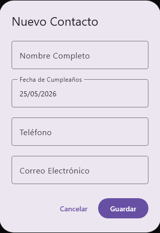
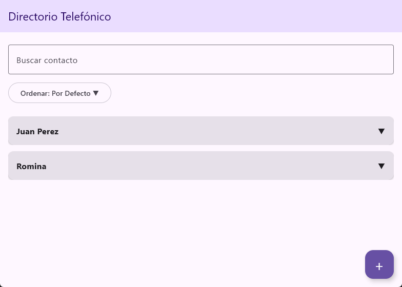

# Proyecto Lenguaje de Programación

---
## Integrantes

- **Jorge Arroyo Herrera**
- **Gael Antonio Ayuso Contreras**
- **Cristopher Israel Cen Santana**

**Link repositorio:** [Proyecto Lenguaje de Programación](https://github.com/gael-ayuso/proyectoCuri.git)

---
## Índice

1. [Organización del Proyecto](#Organización%20del%20Proyecto)
2. [Estructuras de Datos y Almacenamiento](#Estructuras%20de%20Datos%20y%20Almacenamiento)
3. [Clases](#Clases)
   - [Contacto](#Contacto%20👤)
   - [LocalDateSerializer](#LocalDateSerializer)
   - [ContactoController](#ContactoController-🎛️)
   - [ContactoDAOJSON](#ContactoDAOJSON-📄)
4. [Interfaz Gráfica (UI)](#Interfaz-Grafica-🖥️)
   - [Tarjeta Contacto](#Tarjeta-Contacto)
   - [Menú filtros](#Menú-filtros)
   - [Formulario Contacto](#Formulario-Contacto)
   - [App](#App)
5. [Imágenes de ejecución](#imágenes-de-ejecución)

---
## Organización del Proyecto

El proyecto está escrito en [Kotlin](https://kotlinlang.org/), utilizando el framework de [Kotlin Compose Multiplatform](https://kotlinlang.org/compose-multiplatform/) para la UI. Utilizando la arquitectura `MVC` (Model View Controller).

Para la organización de la aplicación, los elementos del código se estructuran y clasifican de la siguiente manera:

* **Clases:**
  * `Contacto`: Modelo que encapsula los atributos y validaciones de un contacto.
  * `ContactoController`: Controlador que implementa las reglas de negocio, ordenación y validación de duplicados.
  * `ContactoDAOJSON`: DAO que gestiona la lectura y escritura en el almacenamiento persistente.
* **Objetos (Objects):**
  * `LocalDateSerializer`: Objeto singleton que implementa la interfaz `KSerializer` para dar formato de serialización a la fecha `LocalDate`.
* **Funciones y Procedimientos:**
  * *Funciones:  `readAll()`, `readByName()`, `obtenerContactosPorCumpleanosProximo()`, `obtenerContactosOrdenAlfabetico()`.
  * *Procedimientos : `create()`, `update()`, `delete()`, `guardarTodos()`.
* **Eventos y Estados:**
  * Manejo del flujo de interacción y actualización visual en la UI por medio de eventos (`onDeleteClick`, `onEditClick`, `onDismiss`, `onSave`) y administración de estados mutables reactivos (`remember { mutableStateOf(...) }`).

---
## Estructuras de Datos y Almacenamiento

La aplicación gestiona y manipula la información de los contactos en dos capas de almacenamiento:

### 1. Memoria Principal 
* **`List<Contacto>` y `MutableList<Contacto>`**: Estructuras de datos lineales de Kotlin que contienen los objetos de tipo `Contacto` en memoria mientras la aplicación está en ejecución. Se emplean para realizar búsquedas mediante filtros funcionales (`filter`) y ordenamiento en tiempo de ejecución (`sortedBy`).
* **Estados de Compose** : Variables dinámicas de estado (`mutableStateOf`) que contienen las listas de contactos y que notifican a los componentes de la interfaz de usuario para redibujarse automáticamente ante inserciones, actualizaciones o eliminaciones.

### 2. Memoria Secundaria 
* **Archivo de texto en formato plano JSON (`contactos.json`)**: Ubicado físicamente en el directorio `data/` del sistema de archivos. La persistencia se logra al serializar las estructuras en memoria principal a una cadena estructurada JSON (mediante `Json.encodeToString`) y guardarla en disco a través de la API de I/O de Kotlin (`File.writeText`). A su vez, se recuperan los datos al iniciar la aplicación leyendo el archivo de texto y deserializándolo a objetos en memoria (mediante `Json.decodeFromString`).

---
## Clases

El proyecto está dividido en 3 clases principales `Contacto`, `ContactoController` y `ContactoDAOJSON`. En este caso utilizaremos un archivo `.json` para almacenar los datos de los contactos.

#### Contacto 👤
Esta es una data class que se encarga de almacenar los datos de los Contactos.

```kotlin
@Serializable  
data class Contacto(  
    // Agregamos el ID invisible  
    val id: String = UUID.randomUUID().toString(),  
    var name: String,  
    val birthDate: @Serializable(with = LocalDateSerializer::class) LocalDate,  
    val phoneNumber: String,  
    val email: String  
) {  
    init {  
        require(Regex("^[a-zA-Z0-9_.+-]+@[a-zA-Z0-9-]+\\.[a-zA-Z0-9-.]+\$").matches(email)) {  
            "El formato del email no es válido"  
        }  
        require(Regex("^[0-9]+\$").matches(phoneNumber)) {  
            "El número de teléfono solo debe contener dígitos"  
        }  
    }  
}
```

El uso de la anotación `@Serializable` nos permite convertir la clase a un formato `JSON` para poder almacenar los datos; el uso de `@Serializable(with = LocalDateSerializer::class)` es debido a que `LocalDate` es una clase de Java que no puede ser directamente serializada por Kotlin es por eso que se utiliza un `object` que implementa `KSerializer` para darle formato a `Local Date`.

```kotlin
object LocalDateSerializer : KSerializer<LocalDate> {  
    override val descriptor: SerialDescriptor = PrimitiveSerialDescriptor("LocalDate", PrimitiveKind.STRING)  
    override fun serialize(encoder: Encoder, value: LocalDate) {  
        encoder.encodeString(value.format(DateTimeFormatter.ISO_LOCAL_DATE))  
    }  
    override fun deserialize(decoder: Decoder): LocalDate {  
        return LocalDate.parse(decoder.decodeString(), DateTimeFormatter.ISO_LOCAL_DATE)  
    }  
}
```

#### ContactoController 🎛️

Esta clase implementa la interfaz `ContactoDAO`, que tiene las funciones `create`, `readByName`, `readAll`, `update`, `delete`. Tenemos un objeto `ContactoDAO` instanciado en la clase, el cual se encarga de leer, modificar y eliminar datos del `JSON`. 

```kotlin
class ContactoController : ContactoDAO {  
    private val dao: ContactoDAO = ContactoDAOJSON()  
  
    override fun create(contacto: Contacto) {  
        val duplicado = dao.readByName(contacto.name)  
  
        if (duplicado != null) {  
            throw Exception("Ya existe un contacto con ese nombre.")  
        }  
  
        dao.create(contacto)  
    }  
  
    override fun readByName(name: String): Contacto? {  
        return dao.readByName(name)  
    }  
  
    override fun readAll(): List<Contacto> {  
        return dao.readAll()  
    }  
  
    override fun update(contacto: Contacto) {  
        dao.update(contacto)  
    }  
  
    override fun delete(contacto: Contacto) {  
        dao.delete(contacto)  
    }  
  
    /**  
     *  Listar los contactos y su fecha de cumpleaños ordenados a partir del día actual.     */    fun obtenerContactosPorCumpleanosProximo(): List<Contacto> {  
        val today = LocalDate.now()  
  
        return dao.readAll().sortedBy { contacto ->  
            // Cambiamos el año del cumpleaños al año actual para comparar los diasw  
            val cumpleEsteAno = contacto.birthDate.withYear(today.year)  
  
            // Si el cumpleaños ya paso, calculamos los dias para el proximo año  
            val proximoCumple = if (cumpleEsteAno.isBefore(today)) {  
                cumpleEsteAno.plusYears(1)  
            } else {  
                cumpleEsteAno  
            }  
  
            // Devuelve los dias que faltan (orden de menor a mayor)  
            ChronoUnit.DAYS.between(today, proximoCumple)  
        }  
    }  
  
    /**  
     * Listar todos los contactos ordenados alfabéticamente por nombre.     */    fun obtenerContactosOrdenAlfabetico(): List<Contacto> {  
        return dao.readAll().sortedBy { it.name.lowercase() }  
    }  
}
```

#### ContactoDAOJSON 📄

Esta clase implementa la interfaz `ContactoDAO`. Se encarga de la logica detras de como interpretar el archivo `JSON` y extraer los datos.

```kotlin
class ContactoDAOJSON : ContactoDAO {  
  
    private val archivo = if (File("data/contactos.json").exists()) {  
        File("data/contactos.json")  
    } else {  
        File("../data/contactos.json")  
    }  
  
    override fun readAll(): List<Contacto> {  
        // Si el archivo no existe o está vacío, devolvemos una lista vacía  
        if (!archivo.exists() || archivo.readText().isBlank()) {  
            println("No existe el archivos")  
            return emptyList()  
        }  
  
        val textoJson = archivo.readText()  
        return Json.decodeFromString(textoJson)  
    }  
  
    override fun create(contacto: Contacto) {  
        val listaActual = readAll().toMutableList()  
        listaActual.add(contacto)  
        guardarTodos(listaActual)  
    }  
  
    override fun readByName(name: String): Contacto? {  
        // ignoramos mayúsculas y minúsculas  
        return readAll().find { it.name.equals(name, ignoreCase = true) }  
    }  
  
    override fun update(contacto: Contacto) {  
        val listaActual = readAll().toMutableList()  
        // Ahora buscamos exactamente por el ID invisible  
        val indice = listaActual.indexOfFirst { it.id == contacto.id }  
  
        if (indice != -1) {  
            listaActual[indice] = contacto  
            guardarTodos(listaActual)  
        }  
    }  
  
    override fun delete(contacto: Contacto) {  
        val listaActual = readAll().toMutableList()  
        // Borramos usando una función que filtra por el ID  
        listaActual.removeAll { it.id == contacto.id }  
        guardarTodos(listaActual)  
    }  
  
    // evita repetir código  
    private fun guardarTodos(lista: List<Contacto>) {  
        val textoJson = Json.encodeToString(lista)  
        archivo.writeText(textoJson)  
    }  
}
```

---
## Interfaz Grafica 🖥️

Para la UI como fue mencionado previamente utilizamos el framework de Compose Multiplatform. Tenemos una interfaz basada en una arquitectura de componentes, esto permite la reusabilidad de estos, además de agregar organización al código.

#### Tarjeta Contacto

Es una función de Kotlin Compose que se encarga de dibujar la tarjeta de contacto pasandole como parámetros `contacto: Contacto`, `onDeleteClick: () -> Unit` y `onEditClick:() -> Unit`, es importante recalcar que `() -> Unit` hace referencia a un procedimiento que es pasado como parámetro.

##### Previsualización

*Tarjeta contraída*


---
*Tarjeta expandida*


##### Código Tarjeta Contacto

```kotlin
package ui.components

import androidx.compose.animation.animateContentSize
import androidx.compose.foundation.clickable
import androidx.compose.foundation.layout.*
import androidx.compose.material3.*
import androidx.compose.material3.HorizontalDivider
import androidx.compose.runtime.*
import androidx.compose.ui.Alignment
import androidx.compose.ui.Modifier
import androidx.compose.ui.text.font.FontWeight
import androidx.compose.ui.tooling.preview.Preview
import androidx.compose.ui.unit.dp
import models.Contacto
import java.time.format.DateTimeFormatter

@Composable
fun TarjetaContacto(
    contacto: Contacto,
    onDeleteClick: () -> Unit,
    onEditClick: () -> Unit
) {
    var expandido by remember { mutableStateOf(false) }

    Card(
        modifier = Modifier
            .fillMaxWidth()
            .padding(vertical = 6.dp)
            .clickable { expandido = !expandido } // Al hacer clic en cualquier parte, cambia el estado
            .animateContentSize(), // ¡Esta línea hace toda la magia de la animación suave!
        elevation = CardDefaults.cardElevation(defaultElevation = 2.dp) // Sombra sutil
    ) {
        Column(
            modifier = Modifier.padding(16.dp)
        ) {
            Row(
                modifier = Modifier.fillMaxWidth(),
                horizontalArrangement = Arrangement.SpaceBetween,
                verticalAlignment = Alignment.CenterVertically
            ) {
                Text(
                    text = contacto.name,
                    style = MaterialTheme.typography.titleMedium,
                    fontWeight = FontWeight.Bold
                )
                // Flecha indicadora que cambia según el estado
                Text(if (expandido) "▲" else "▼", style = MaterialTheme.typography.bodyLarge)
            }

            if (expandido) {
                Spacer(modifier = Modifier.height(12.dp))
                HorizontalDivider(Modifier, DividerDefaults.Thickness, DividerDefaults.color)
                Spacer(modifier = Modifier.height(12.dp))

                val fechaVisual = contacto.birthDate.format(DateTimeFormatter.ofPattern("dd/MM/yyyy"))

                Text("Cumpleaños: $fechaVisual", style = MaterialTheme.typography.bodyMedium)
                Spacer(modifier = Modifier.height(6.dp))
                Text("Teléfono: ${contacto.phoneNumber}", style = MaterialTheme.typography.bodyMedium)
                Spacer(modifier = Modifier.height(6.dp))
                Text("Correo: ${contacto.email}", style = MaterialTheme.typography.bodyMedium)

                Spacer(modifier = Modifier.height(16.dp))

                Row(
                    modifier = Modifier.fillMaxWidth(),
                    horizontalArrangement = Arrangement.End,
                    verticalAlignment = Alignment.CenterVertically
                ) {
                    OutlinedButton(
                        onClick = onEditClick,
                        modifier = Modifier.padding(end = 8.dp)
                    ) { Text("Editar ") }

                    Button(
                        onClick = onDeleteClick,
                        colors = ButtonDefaults.buttonColors(containerColor = MaterialTheme.colorScheme.error)
                    ) { Text("Borrar ") }
                }
            }
        }
    }
}
```

--- 
#### Menú filtros

##### Previsualización

*Menú filtros (Por defecto)*


---
*Menú filtros (Expandido)*


##### Código Menú Filtros

```kotlin
package ui.components

import androidx.compose.foundation.layout.Box
import androidx.compose.foundation.layout.wrapContentSize
import androidx.compose.material3.*
import androidx.compose.runtime.*
import androidx.compose.ui.Modifier
import androidx.compose.ui.tooling.preview.Preview

@Composable
fun MenuFiltros(
    onOrdenCambio: (Int) -> Unit
) {
    var expandido by remember { mutableStateOf(false) }
    val opciones = listOf("Por Defecto", "A-Z (Alfabético)", "Próximos Cumpleaños")
    var seleccionActual by remember { mutableStateOf(opciones[0]) }

    Box {
        OutlinedButton(onClick = { expandido = true }) {
            Text("Ordenar: $seleccionActual ▼")
        }

        DropdownMenu(
            expanded = expandido,
            onDismissRequest = { expandido = false }
        ) {
            opciones.forEachIndexed { index, opcion ->
                DropdownMenuItem(
                    text = { Text(opcion) },
                    onClick = {
                        expandido = false
                        seleccionActual = opcion
                        onOrdenCambio(index)
                    }
                )
            }
        }
    }
}
```

---

#### Formulario Contacto

Es un pop up que se visualiza cuando el usuario desea editar o añadir un nuevo contacto a la lista. Como parámetros tenemos `contactoAEditar: Contacto?` que inicialmente esta inicializado como `null` en dado caso que el formulario se utilizado para crear un nuevo contacto; `onDismiss: () -> Unit` este recibe un procedimiento que nos sirve en dado caso que no se desee completar la acción,  `onSave: (Contacto) -> Unit` este parámetro recibe una función que se encarga de guardar el contacto en el `JSON`.

##### Previsualización

*Formulario Contacto*


##### Código Formulario Contacto

```kotlin
package ui.components

import androidx.compose.foundation.clickable
import androidx.compose.foundation.layout.*
import androidx.compose.material3.*
import androidx.compose.runtime.*
import androidx.compose.ui.Modifier
import androidx.compose.ui.tooling.preview.Preview
import androidx.compose.ui.unit.dp
import models.Contacto
import java.time.Instant
import java.time.LocalDate
import java.time.ZoneId
import java.time.ZoneOffset
import java.time.format.DateTimeFormatter
import java.util.UUID

@OptIn(ExperimentalMaterial3Api::class)
@Composable
fun FormularioContacto(
    contactoAEditar: Contacto? = null,
    onDismiss: () -> Unit,
    onSave: (Contacto) -> Unit
) {
    var txtNombre by remember { mutableStateOf(contactoAEditar?.name ?: "") }
    var txtTelefono by remember { mutableStateOf(contactoAEditar?.phoneNumber ?: "") }
    var txtCorreo by remember { mutableStateOf(contactoAEditar?.email ?: "") }
    var mensajeError by remember { mutableStateOf("") }

    var fechaSeleccionada by remember { mutableStateOf(contactoAEditar?.birthDate ?: LocalDate.now()) }
    var mostrarCalendario by remember { mutableStateOf(false) }
    val formateadorVista = DateTimeFormatter.ofPattern("dd/MM/yyyy")

    val datePickerState = rememberDatePickerState(
        initialSelectedDateMillis = contactoAEditar?.birthDate?.atStartOfDay(ZoneOffset.UTC)?.toInstant()?.toEpochMilli()
    )

    AlertDialog(
        onDismissRequest = onDismiss,
        title = { Text(if (contactoAEditar != null) "Editar Contacto" else "Nuevo Contacto") },
        text = {
            Column(verticalArrangement = Arrangement.spacedBy(12.dp)) {

                OutlinedTextField(
                    value = txtNombre,
                    onValueChange = { txtNombre = it },
                    label = { Text("Nombre Completo") },
                    modifier = Modifier.fillMaxWidth(),
                    singleLine = true
                )

                OutlinedTextField(
                    value = fechaSeleccionada.format(formateadorVista),
                    onValueChange = { },
                    label = { Text("Fecha de Cumpleaños") },
                    enabled = false,
                    modifier = Modifier
                        .fillMaxWidth()
                        .clickable { mostrarCalendario = true },
                    colors = OutlinedTextFieldDefaults.colors(
                        disabledTextColor = MaterialTheme.colorScheme.onSurface,
                        disabledBorderColor = MaterialTheme.colorScheme.outline,
                        disabledLabelColor = MaterialTheme.colorScheme.onSurfaceVariant,
                        disabledLeadingIconColor = MaterialTheme.colorScheme.onSurfaceVariant
                    )
                )

                OutlinedTextField(
                    value = txtTelefono,
                    onValueChange = { txtTelefono = it },
                    label = { Text("Teléfono") },
                    modifier = Modifier.fillMaxWidth(),
                    singleLine = true
                )

                OutlinedTextField(
                    value = txtCorreo,
                    onValueChange = { txtCorreo = it },
                    label = { Text("Correo Electrónico") },
                    modifier = Modifier.fillMaxWidth(),
                    singleLine = true
                )

                if (mensajeError.isNotEmpty()) {
                    Text(
                        text = mensajeError,
                        color = MaterialTheme.colorScheme.error,
                        style = MaterialTheme.typography.bodySmall,
                        modifier = Modifier.padding(top = 4.dp)
                    )
                }
            }
        },
        confirmButton = {
            Button(onClick = {
                try {
                    val idFinal = contactoAEditar?.id ?: UUID.randomUUID().toString()

                    val contactoGuardado = Contacto(
                        id = idFinal,
                        name = txtNombre,
                        birthDate = fechaSeleccionada,
                        phoneNumber = txtTelefono,
                        email = txtCorreo
                    )
                    onSave(contactoGuardado)
                } catch (e: Exception) {
                    mensajeError = e.message ?: "Datos inválidos."
                }
            }) { Text("Guardar") }
        },
        dismissButton = {
            TextButton(onClick = onDismiss) { Text("Cancelar") }
        }
    )

    if (mostrarCalendario) {
        DatePickerDialog(
            onDismissRequest = { mostrarCalendario = false },
            confirmButton = {
                TextButton(onClick = {
                    datePickerState.selectedDateMillis?.let { millis ->
                        fechaSeleccionada = Instant.ofEpochMilli(millis).atZone(ZoneId.of("UTC")).toLocalDate()
                    }
                    mostrarCalendario = false
                }) { Text("Aceptar") }
            },
            dismissButton = {
                TextButton(onClick = { mostrarCalendario = false }) { Text("Cancelar") }
            }
        ) { DatePicker(state = datePickerState) }
    }
}
```

---

#### App

Esta función se encarga de unir los componentes previamente expuestos. Organizándolos de forma ordenada en código, y gracias al uso de componentes la cantidad de código es menor a que si dibujáramos componente por componente.

##### Previsualización

*Pantalla de inicio de la App*


##### Código Principal App.kt


```kotlin
@OptIn(ExperimentalMaterial3Api::class)  
@Composable  
fun App() {  
    val controller = remember { ContactoController() }  
  
    var listaCompleta by remember { mutableStateOf(controller.readAll()) }  
    var mostrarFormulario by remember { mutableStateOf(false) }  
    var textoBusqueda by remember { mutableStateOf("") }  
    var contactoParaBorrar by remember { mutableStateOf<Contacto?>(null) }  
    var contactoEnEdicion by remember { mutableStateOf<Contacto?>(null) }  
  
    val listaMostrada = if (textoBusqueda.isBlank()) {  
        listaCompleta  
    } else {  
        listaCompleta.filter { it.name.contains(textoBusqueda, ignoreCase = true) }  
    }  
  
    MaterialTheme {  
        Scaffold(  
            topBar = {  
                TopAppBar(  
                    title = { Text("Directorio Telefónico", style = MaterialTheme.typography.titleLarge) },  
                    colors = TopAppBarDefaults.topAppBarColors(  
                        containerColor = MaterialTheme.colorScheme.primaryContainer,  
                        titleContentColor = MaterialTheme.colorScheme.onPrimaryContainer  
                    )  
                )  
            },  
            floatingActionButton = {  
                FloatingActionButton(  
                    onClick = { mostrarFormulario = true },  
                    containerColor = MaterialTheme.colorScheme.primary,  
                    contentColor = MaterialTheme.colorScheme.onPrimary  
                ) { Text("+", style = MaterialTheme.typography.headlineMedium) }  
            }        ) { paddingValues ->  
            Column(  
                modifier = Modifier  
                    .fillMaxSize()  
                    .padding(paddingValues)  
                    .padding(16.dp)  
            ) {  
                OutlinedTextField(  
                    value = textoBusqueda,  
                    onValueChange = { textoBusqueda = it },  
                    label = { Text("Buscar contacto") },  
                    modifier = Modifier.fillMaxWidth(),  
                    singleLine = true  
                )  
  
                Spacer(modifier = Modifier.height(12.dp))  
  
                MenuFiltros(  
                    onOrdenCambio = { indiceSeleccionado ->  
                        when (indiceSeleccionado) {  
                            0 -> listaCompleta = controller.readAll()  
                            1 -> listaCompleta = controller.obtenerContactosOrdenAlfabetico()  
                            2 -> listaCompleta = controller.obtenerContactosPorCumpleanosProximo()  
                        }  
                    }  
                )  
  
                Spacer(modifier = Modifier.height(16.dp))  
  
                LazyColumn(modifier = Modifier.fillMaxWidth().weight(1f)) {  
                    items(listaMostrada) { contacto ->  
                        TarjetaContacto(  
                            contacto = contacto,  
                            onDeleteClick = {  
                                contactoParaBorrar = contacto  
                            },  
                            onEditClick = {  
                                contactoEnEdicion = contacto  
                                mostrarFormulario = true  
                            }  
                        )  
                    }  
                }            }        }  
        // CONFIRMACIÓN DE BORRADO  
        if (contactoParaBorrar != null) {  
            AlertDialog(  
                onDismissRequest = { contactoParaBorrar = null },  
                title = { Text("Confirmar eliminación") },  
                text = { Text("¿Estás seguro de que deseas eliminar a ${contactoParaBorrar?.name}? Esta acción no se puede deshacer.") },  
                confirmButton = {  
                    Button(  
                        onClick = {  
                            controller.delete(contactoParaBorrar!!)  
                            listaCompleta = controller.readAll()  
                            contactoParaBorrar = null  
                        },  
                        colors = ButtonDefaults.buttonColors(containerColor = MaterialTheme.colorScheme.error)  
                    ) { Text("Sí, eliminar")}  
                }, dismissButton = {  
                    TextButton(onClick = { contactoParaBorrar = null })  
                    { Text("Cancelar") }  
                }            )  
        }  
  
        // Formulario de agregación/edición  
        if (mostrarFormulario) {  
            FormularioContacto(  
                contactoAEditar = contactoEnEdicion,  
                onDismiss = {  
                    mostrarFormulario = false  
                    contactoEnEdicion = null  
                },  
                onSave = { contactoGuardado ->  
                    if (contactoEnEdicion != null) {  
                        controller.update(contactoGuardado)  
                    } else {  
                        controller.create(contactoGuardado)  
                    }  
  
                    listaCompleta = controller.readAll()  
                    mostrarFormulario = false  
                    contactoEnEdicion = null  
                }  
            )  
        }  
    }  
}
```

---
## Imágenes de ejecución

*Pagina principal*


---
*Búsqueda de contactos*


---
*Adición de contactos*


---
*Edición de datos de contactos*


---
*Eliminación de contactos*

